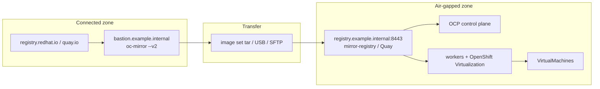

# Architecture

Placeholders only: `registry.example.internal:8443`, `bastion.example.internal`, `cluster.example.internal`.

## Topology

Two trust zones:

1. **Connected bastion (or isolated mirror workstation)** — has internet (or a one-way sneakernet). Runs `oc-mirror` plugin v2, holds the subscription pull secret locally (never in git), and may host or feed the mirror registry.
2. **Air-gapped cluster** — no route to `registry.redhat.io` / Quay / OperatorHub. Nodes pull only from the internal mirror. DNS, NTP, and the registry are local.

**Fact:** Fully disconnected mirroring is **mirror-to-disk** on a connected host, physical/SFTP transfer, then **disk-to-mirror** beside the registry. Partially disconnected (bastion can see both internet and registry) is **mirror-to-mirror**. [oc-mirror plugin v2](https://docs.redhat.com/en/documentation/openshift_container_platform/4.18/html/disconnected_environments/about-installing-oc-mirror-v2).

## Mirror registry

**Fact:** You need a Docker V2-2 registry. Options: existing **Red Hat Quay**, or **mirror registry for Red Hat OpenShift** (small-scale Quay via `mirror-registry` CLI, included with an OCP subscription; for install/Operator images, not a general production registry). [Creating a mirror registry](https://docs.redhat.com/en/documentation/openshift_container_platform/4.18/html/disconnected_environments/installing-mirroring-creating-registry). Every cluster machine must reach it.

## oc-mirror plugin v2

**Fact:** Preferred mirroring method. Always pass `--v2`. v1 is deprecated. Generates **IDMS**, **ITMS**, **CatalogSource** (OLM Classic), optional **ClusterCatalog** (OLM v1) and **UpdateService**. Image set API: `mirror.openshift.io/v2alpha1`. Dry-run: `oc mirror ... --dry-run --v2`. [oc-mirror plugin v2](https://docs.redhat.com/en/documentation/openshift_container_platform/4.18/html/disconnected_environments/about-installing-oc-mirror-v2).

Pin in `ImageSetConfiguration`:

- Platform channel `stable-4.18` (or your 4.y) with explicit min/max z-stream.
- Operator catalog `registry.redhat.io/redhat/redhat-operator-index:v4.18` filtered to `kubevirt-hyperconverged` (and optional `mtv-operator`).

See `scripts/imageset-config.yaml.example`.

## IDMS / ITMS (ICSP is legacy)

**Fact:** oc-mirror v2 emits **ImageDigestMirrorSet** (digest pulls) and **ImageTagMirrorSet** (tag pulls). These cover the **full** image set. **ImageContentSourcePolicy (ICSP)** is the v1 / legacy object; migrate with `oc adm migrate icsp` if you still have ICSP YAML. [oc-mirror v2 CRs](https://docs.redhat.com/en/documentation/openshift_container_platform/4.18/html/disconnected_environments/about-installing-oc-mirror-v2); [Image configuration resources](https://docs.redhat.com/en/documentation/openshift_container_platform/4.18/html/images/image-configuration).

**Fact:** Do not edit `spec.imageDigestMirrors` / `spec.imageTagMirrors` on generated CRs. Apply `working-dir/cluster-resources`.

ABI/IPI `install-config.yaml` still uses `imageContentSources` plus `additionalTrustBundle` for the registry CA at **install** time. After install, IDMS/ITMS are the day-2 objects.

## Disconnected OLM CatalogSource (CNV)

**Fact:** Default OperatorHub catalogs need the internet. Disable them (`disableAllDefaultSources`) and create a **CatalogSource** pointing at the mirrored index. [OLM in disconnected environments](https://docs.redhat.com/en/documentation/openshift_container_platform/4.18/html/disconnected_environments/olm-restricted-networks).

**Fact:** Restricted-network OpenShift Virtualization install requires that OLM disconnected configuration. Operator package: `kubevirt-hyperconverged`, channel `stable`, namespace `openshift-cnv`. [Installing OpenShift Virtualization](https://docs.redhat.com/en/documentation/openshift_container_platform/4.18/html/virtualization/installing).

## HyperConverged Operator (HCO)

**Fact:** After the Operator is installed, create **HyperConverged** `kubevirt-hyperconverged` in `openshift-cnv`. HCO is the single entry point; it creates KubeVirt, CDI, SSP, and related CRs. [About OpenShift Virtualization / HCO](https://docs.redhat.com/en/documentation/openshift_container_platform/4.18/html/virtualization/about).

## RHCOS / ISO

**Fact:** ABI writes RHCOS to disk from the agent ISO. Disconnected ABI needs mirrored release images in `install-config.yaml` (`additionalTrustBundle`, `imageContentSources`). [ABI disconnected mirroring](https://docs.redhat.com/en/documentation/openshift_container_platform/4.18/html/installing_an_on-premise_cluster_with_the_agent-based_installer/understanding-disconnected-installation-mirroring). IPI restricted-network procedures also require a retrieved RHCOS image in an accessible location (platform-specific).

**Inference:** Treat RHCOS live ISO / rootfs URLs as connected-only unless you host them internally (`bootArtifactsBaseURL` on ABI minimal ISO). Prefer a full agent ISO in air-gap.

## Optional MTV disconnected

Mirror `mtv-operator` into the same index. MTV still needs **source → target** network for disk transfer even when catalogs are local. Warm vs cold: [docs/risks-gotchas.md](risks-gotchas.md).

## Example CRs

See `examples/` for placeholder IDMS, ITMS, CatalogSource, Subscription, HyperConverged, and VirtualMachine.
